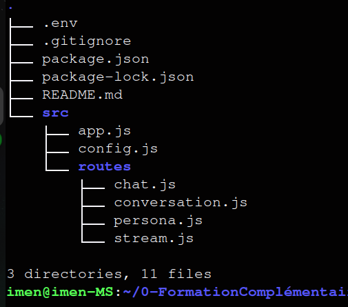
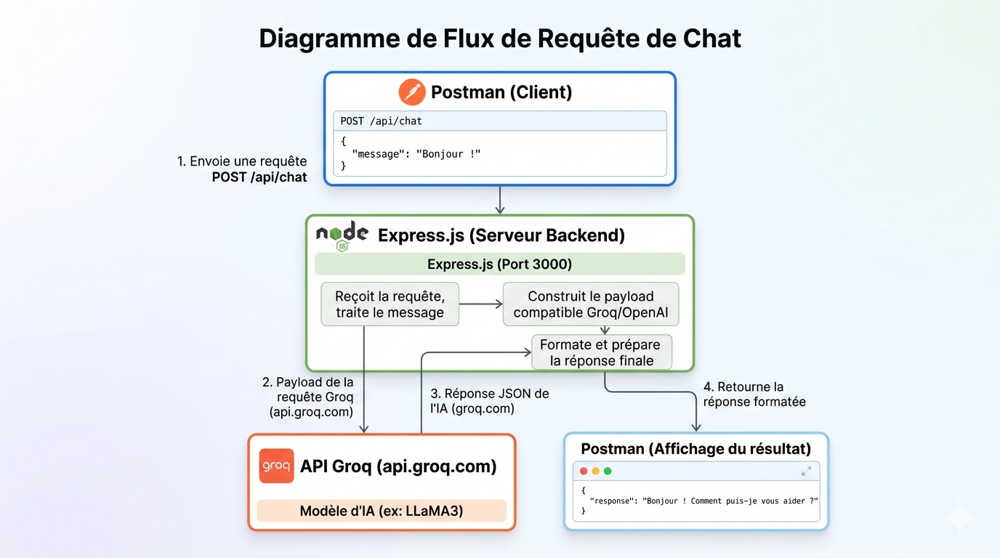
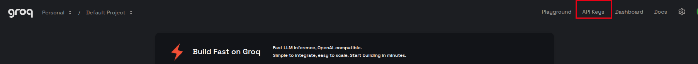
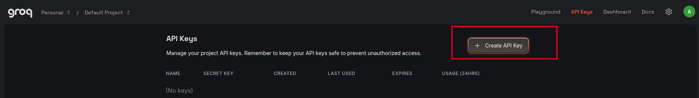
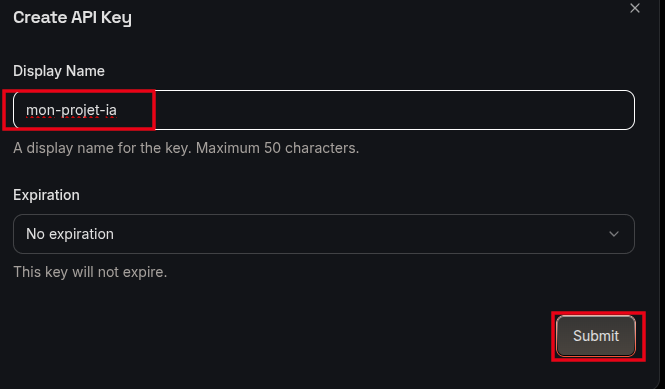
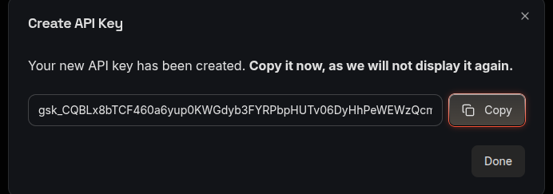
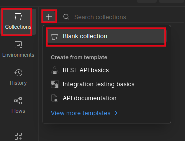
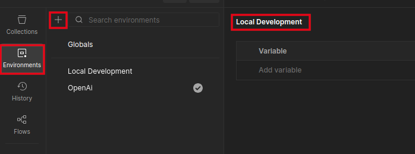
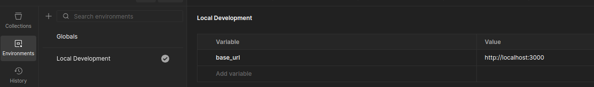

# 🤖 Guide Complet : Créer un Assistant IA avec l'API Groq — 100% Gratuit & Testé via Postman

> **Pour débutants** — Pas à pas, de zéro à un backend IA fonctionnel, sans payer un centime.
> **Stack :** Node.js + Express.js | **Tests :** Postman | **IA :** Groq — 100% gratuit, sans carte bancaire

---

## 📋 Table des matières

1. [Pourquoi Groq ? Comparatif des APIs gratuites](#1-pourquoi-groq)
2. [Architecture du projet](#2-architecture)
3. [Prérequis et installation](#3-prerequis)
4. [Obtenir la clé API Groq gratuitement](#4-cle-api)
5. [Configurer Postman](#5-postman)
6. [Créer le projet Express](#6-projet)
7. [Fonctionnalité 1 — Chat simple](#7-chat-simple)
8. [Fonctionnalité 2 — Conversation multi-tours](#8-conversation)
9. [Fonctionnalité 3 — Streaming](#9-streaming)
10. [Fonctionnalité 4 — Système de personas](#10-personas)
11. [Fonctionnalité 5 — Gestion des erreurs](#11-erreurs)
12. [Récapitulatif des routes & tests Postman](#12-recap)

---

## 1. Pourquoi Groq ? Comparatif des APIs gratuites <a name="1-pourquoi-groq"></a>

Plusieurs providers offrent une API IA gratuite. Voici une comparaison honnête :

| Provider | Modèle gratuit | Limite gratuite | Compatible OpenAI SDK ? | Remarque |
|----------|---------------|-----------------|------------------------|----------|
| **Groq** | `llama-3.3-70b-versatile` | 14 400 req/jour | ✅ Oui | 100% gratuit, sans CB |
| xAI (Grok) | `grok-3-mini` | Crédits payants | ✅ Oui | ❌ Nécessite un paiement |
| Google Gemini | `gemini-1.5-flash` | 15 req/min | ❌ SDK propre | SDK différent |
| Mistral | `mistral-small` | 1 req/sec | ✅ Oui | Très limité |
| Cohere | `command-r` | 1000 req/mois | ❌ SDK propre | Trop limité |

> ✅ **Notre choix : Groq**
> - **100% gratuit** — pas de carte bancaire, pas de crédits à acheter
> - **14 400 requêtes/jour** gratuites — largement suffisant pour apprendre
> - API **compatible avec le SDK OpenAI** — le code est réutilisable sur d'autres providers
> - Modèle **LLaMA 3.3 70B** — très performant, open-source
> - Inscription en 30 secondes sur [console.groq.com](https://console.groq.com)

---

## 2. Architecture du projet <a name="2-architecture"></a>



```
mon-assistant-ia/
│
├── .env                    ← Variables d'environnement (clé API) — ne jamais publier !
├── .gitignore              ← Fichiers à exclure de Git
├── package.json            ← Dépendances du projet
│
└── src/
    ├── app.js              ← Point d'entrée Express
    ├── config.js           ← Configuration centralisée
    │
    └── routes/
        ├── chat.js         ← POST /api/chat
        ├── conversation.js ← POST /api/conversation
        ├── stream.js       ← POST /api/stream
        └── persona.js      ← GET+POST /api/persona
```

### Schéma du flux d'une requête

```

```

---

## 3. Prérequis et installation <a name="3-prerequis"></a>

### 3.1 Installer Node.js

Rends-toi sur [https://nodejs.org](https://nodejs.org) et télécharge la version **LTS**.

Vérifie l'installation dans ton terminal :

```bash
node --version   # Doit afficher v18+ ou v20+
npm --version    # Doit afficher 9+
```

### 3.2 Installer Postman

Télécharge Postman sur [https://www.postman.com/downloads](https://www.postman.com/downloads).

> Postman est l'outil standard pour tester des APIs. Il permet d'envoyer des requêtes HTTP et de visualiser les réponses sans écrire de code côté client.

### 3.3 Créer le projet

Ouvre ton terminal et exécute ces commandes **une par une** :

```bash
# Créer le dossier du projet
mkdir mon-assistant-ia
cd mon-assistant-ia

# Initialiser le projet Node.js
npm init -y

# Installer les dépendances
npm install express openai dotenv cors

# Installer nodemon (redémarre le serveur automatiquement à chaque modification)
npm install --save-dev nodemon

# Créer la structure des dossiers
mkdir -p src/routes
```

**À quoi servent ces packages ?**

| Package | Rôle |
|---------|------|
| `express` | Framework web pour créer notre serveur et nos routes |
| `openai` | SDK officiel OpenAI — compatible avec Groq |
| `dotenv` | Charge la clé API depuis le fichier `.env` |
| `cors` | Autorise les requêtes depuis d'autres origines |
| `nodemon` | Redémarre le serveur automatiquement en développement |

### 3.4 Modifier `package.json`

Ouvre `package.json` avec un éditeur de texte et remplace la section `"scripts"` :

```json
{
  "name": "mon-assistant-ia",
  "version": "1.0.0",
  "description": "",
  "main": "index.js",
  "scripts": {
    "test": "echo \"Error: no test specified\" && exit 1",
    "start": "node src/app.js",
    "dev": "nodemon src/app.js"
  },
  "keywords": [],
  "author": "",
  "license": "ISC",
  "type": "commonjs",
  "dependencies": {
    "cors": "^2.8.6",
    "dotenv": "^17.4.2",
    "express": "^5.2.1",
    "openai": "^6.35.0"
  },
  
  "devDependencies": {
    "nodemon": "^3.1.14"
  }
}
```

---

## 4. Obtenir la clé API Groq gratuitement <a name="4-cle-api"></a>

### Étapes détaillées

1. Va sur [https://console.groq.com](https://console.groq.com)
2. Clique sur **"Sign Up"** — tu peux te connecter avec Google ou GitHub
3. Une fois connecté, clique sur **"API Keys"** dans le menu de gauche

4. Clique sur **"Create API Key"**

5. Donne un nom à ta clé (ex : `mon-projet-ia`)

6. **Copie immédiatement la clé** — elle commence par `gsk_` et ne sera plus jamais affichée !


> 🔐 **Règles de sécurité :**
> - Ne partage **jamais** ta clé API
> - Ne la mets **jamais** dans du code publié sur GitHub
> - Utilise **toujours** un fichier `.env` pour la stocker

### Créer le fichier `.env`

> ⚠️ **Important :** Crée ce fichier avec un éditeur de texte (`nano`, VS Code, etc.), **pas avec une commande `cat`** dans le terminal.

```bash
nano .env
```

Colle exactement ceci (remplace avec ta vraie clé) :

```env
# Clé API xAI Grok
GROQ_API_KEY=gsk_xxxxxxxxxxxxxx

# Configuration du serveur
PORT=3000

# Modèle à utiliser
AI_MODEL=llama-3.3-70b-versatile

```

Sauvegarde : **Ctrl+O** → **Entrée** → **Ctrl+X**

### Créer le fichier `.gitignore`

```bash
nano .gitignore
```

```gitignore
# Variables d'environnement — NE JAMAIS PUBLIER
.env

# Dépendances Node.js
node_modules/

```

---

## 5. Configurer Postman <a name="5-postman"></a>

### 5.1 Créer une Collection

1. Ouvre Postman
2. Clique sur **"Collections"** (icône dossier à gauche)
3. Clique sur **"+"** → **"Blank collection"**
4. Nomme-la : `Mon Assistant IA - Groq`


### 5.2 Créer une Variable d'environnement

1. Clique sur **"Environments"** (icône œil à gauche)
2. Clique sur **"+"** → **"Add Environment"**
3. Nomme-le : `Local Development`

4. Ajoute cette variable :

| Variable | Initial Value | Current Value |
|----------|--------------|---------------|
| `base_url` | `http://localhost:3000` | `http://localhost:3000` |



### 5.3 Configuration d'une requête POST dans Postman

Pour chaque test, la configuration est toujours la même :

```
Méthode  : POST (ou GET selon le test)
URL      : {{base_url}}/api/[route]
Headers  : Content-Type: application/json  (ajouté automatiquement avec "raw JSON")
Body     : onglet "Body" → "raw" → sélectionner "JSON" dans le menu déroulant
```

---

## 6. Créer le projet Express <a name="6-projet"></a>

> ⚠️ **Méthode recommandée :** Crée chaque fichier avec `nano` ou ton éditeur de texte (VS Code, etc.) et colle le contenu manuellement. Évite les commandes `cat > fichier << 'EOF'` dans le terminal car elles peuvent corrompre les fichiers.

### 6.1 Fichier de configuration — `src/config.js`

Colle exactement ce contenu :

```javascript
require("dotenv").config();

// Vérification que la clé API est bien définie au démarrage
if (!process.env.GROQ_API_KEY) {
  console.error("❌ ERREUR : La variable GROQ_API_KEY n'est pas définie dans le fichier .env");
  process.exit(1);
}

const config = {
  // Clé API Groq
  apiKey: process.env.GROQ_API_KEY,

  // URL de base de l'API Groq (format compatible OpenAI)
  baseURL: "https://api.groq.com/openai/v1",

  // Modèle IA à utiliser
  model: process.env.AI_MODEL || "llama-3.3-70b-versatile",

  // Port du serveur Express
  port: parseInt(process.env.PORT) || 3000,
};

module.exports = config;
```

Sauvegarde : **Ctrl+O** → **Entrée** → **Ctrl+X**

> 💡 **Pourquoi un fichier config séparé ?**
> Si tu changes de provider (Groq → Mistral par exemple), tu modifies **un seul fichier** au lieu de chercher dans tout le code.

### 6.2 Point d'entrée — `src/app.js`

```bash
nano src/app.js
```

```javascript
const express = require("express");
const cors = require("cors");
const config = require("./config");

// Import des routes
const chatRouter = require("./routes/chat");
const conversationRouter = require("./routes/conversation");
const streamRouter = require("./routes/stream");
const personaRouter = require("./routes/persona");

// Création de l'application Express
const app = express();

// ── Middlewares ──────────────────────────────────────────
// Parse automatiquement le JSON des requêtes entrantes
app.use(express.json());

// Autorise les requêtes cross-origin
app.use(cors());

// ── Routes de l'API ──────────────────────────────────────
app.use("/api/chat", chatRouter);
app.use("/api/conversation", conversationRouter);
app.use("/api/stream", streamRouter);
app.use("/api/persona", personaRouter);

// ── Route de santé (health check) ───────────────────────
app.get("/health", (req, res) => {
  res.json({
    status: "ok",
    message: "Le serveur tourne correctement",
    timestamp: new Date().toISOString(),
    model: config.model,
  });
});

// ── Gestion des routes non trouvées (404) ───────────────
// Note : on n'utilise PAS app.use("*", ...) — incompatible avec Express 5 + Node 24
app.use((req, res) => {
  res.status(404).json({
    error: "Route non trouvée",
    message: `La route ${req.originalUrl} n'existe pas`,
  });
});

// ── Démarrage du serveur ─────────────────────────────────
app.listen(config.port, () => {
  console.log(`\n✅ Serveur démarré sur http://localhost:${config.port}`);
  console.log(`🤖 Modèle IA : ${config.model}`);
  console.log(`\nRoutes disponibles :`);
  console.log(`  GET  /health`);
  console.log(`  POST /api/chat`);
  console.log(`  POST /api/conversation`);
  console.log(`  POST /api/stream`);
  console.log(`  GET  /api/persona`);
  console.log(`  POST /api/persona\n`);
});

module.exports = app;
```

### 6.3 Vérifier le démarrage du serveur

Avant de créer les routes, vérifie que `config.js` et `app.js` sont corrects :

```bash
# Vérifier que la première ligne de config.js est correcte
head -1 src/config.js
# Doit afficher : require("dotenv").config();

# Vérifier que la première ligne de app.js est correcte
head -1 src/app.js
# Doit afficher : const express = require("express");
```

---

## 7. Fonctionnalité 1 — Chat simple <a name="7-chat-simple"></a>

### Concept

Le chat simple est la fonctionnalité de base : l'utilisateur envoie **un message**, l'IA répond. Pas de mémoire — chaque requête est indépendante.

```
[message utilisateur] ──→ [API Groq] ──→ [réponse IA]
```

### Créer le fichier — `src/routes/chat.js`

```bash
nano src/routes/chat.js
```

```javascript
const express = require("express");
const OpenAI = require("openai");
const config = require("../config");

const router = express.Router();

// Initialisation du client OpenAI pointant vers Groq
const openai = new OpenAI({
  apiKey: config.apiKey,
  baseURL: config.baseURL, // ← Cette ligne redirige vers Groq au lieu d'OpenAI
});

// ── POST /api/chat ───────────────────────────────────────
router.post("/", async (req, res) => {
  const { message } = req.body;

  // Validation : le message est-il présent et non vide ?
  if (!message || typeof message !== "string" || message.trim() === "") {
    return res.status(400).json({
      error: "Validation échouée",
      message: "Le champ \"message\" est requis et doit être une chaîne non vide",
    });
  }

  // Validation : longueur maximale
  if (message.length > 4000) {
    return res.status(400).json({
      error: "Message trop long",
      message: "Le message ne peut pas dépasser 4000 caractères",
    });
  }

  try {
    // Appel à l'API Groq
    const completion = await openai.chat.completions.create({
      model: config.model,
      messages: [
        {
          role: "user",
          content: message,
        },
      ],
      max_tokens: 1000,  // Limite la longueur de la réponse
      temperature: 0.7,  // 0 = précis/déterministe, 1 = créatif
    });

    // Extraire la réponse
    const aiResponse = completion.choices[0].message.content;

    res.json({
      success: true,
      data: {
        message: aiResponse,
        usage: {
          prompt_tokens: completion.usage.prompt_tokens,
          completion_tokens: completion.usage.completion_tokens,
          total_tokens: completion.usage.total_tokens,
        },
        model: completion.model,
      },
    });

  } catch (error) {
    console.error("Erreur API Groq :", error.message);

    if (error.status === 401) {
      return res.status(401).json({
        error: "Authentification échouée",
        message: "Clé API invalide. Vérifiez votre fichier .env",
      });
    }

    if (error.status === 429) {
      return res.status(429).json({
        error: "Limite de taux atteinte",
        message: "Trop de requêtes. Attendez quelques secondes",
      });
    }

    res.status(500).json({
      error: "Erreur interne",
      message: error.message,
    });
  }
});

// ── POST /api/chat/test-error ────────────────────────────
// Route utilitaire pour tester les réponses d'erreur
router.post("/test-error", (req, res) => {
  const { type } = req.body;

  const erreurs = {
    400: { status: 400, body: { error: "Mauvaise requête", message: "Données invalides" } },
    401: { status: 401, body: { error: "Non autorisé", message: "Clé API invalide" } },
    429: { status: 429, body: { error: "Trop de requêtes", retry_after: 60 } },
    500: { status: 500, body: { error: "Erreur serveur" } },
  };

  const erreur = erreurs[type];
  if (!erreur) {
    return res.status(400).json({
      error: "Types disponibles : 400, 401, 429, 500",
    });
  }

  res.status(erreur.status).json(erreur.body);
});

module.exports = router;
```

### Comprendre les paramètres de l'API

| Paramètre | Type | Valeurs | Description |
|-----------|------|---------|-------------|
| `model` | string | `llama-3.3-70b-versatile` | Le modèle IA à utiliser |
| `messages` | array | — | Tableau des messages |
| `max_tokens` | number | 1–8000 | Longueur max de la réponse |
| `temperature` | number | 0.0–2.0 | Créativité : 0 = précis, 1 = créatif |

### Tests Postman — Fonctionnalité 1

**Test A — Chat valide :**

```
Méthode : POST
URL     : {{base_url}}/api/chat
Body    : raw → JSON
```

```json
{
  "message": "Explique-moi ce qu'est une API en 3 phrases simples."
}
```

Réponse attendue (status 200) :

```json
{
  "success": true,
  "data": {
    "message": "Une API est une interface qui permet à deux programmes de communiquer...",
    "usage": {
      "prompt_tokens": 25,
      "completion_tokens": 87,
      "total_tokens": 112
    },
    "model": "llama-3.3-70b-versatile"
  }
}
```

**Test B — Message vide (validation) :**

```json
{
  "message": ""
}
```

Réponse attendue (status 400) :

```json
{
  "error": "Validation échouée",
  "message": "Le champ \"message\" est requis et doit être une chaîne non vide"
}
```

**Test C — Champ message manquant :**

```json
{
  "texte": "Bonjour"
}
```

Réponse attendue (status 400) — même erreur de validation.

---

## 8. Fonctionnalité 2 — Conversation multi-tours <a name="8-conversation"></a>

### Concept

L'IA n'a pas de mémoire native. Pour simuler une conversation, on envoie **tout l'historique** à chaque requête. C'est le même mécanisme que ChatGPT.

```
Requête 1 : [user: "Bonjour, je m'appelle Alice"]
Requête 2 : [user: "Bonjour..."] + [assistant: "..."] + [user: "Tu te souviens de moi ?"]
```

### Créer le fichier — `src/routes/conversation.js`

```bash
nano src/routes/conversation.js
```

```javascript
const express = require("express");
const OpenAI = require("openai");
const config = require("../config");

const router = express.Router();

const openai = new OpenAI({
  apiKey: config.apiKey,
  baseURL: config.baseURL,
});

// ── POST /api/conversation ───────────────────────────────
router.post("/", async (req, res) => {
  const { messages } = req.body;

  // Validation : messages doit être un tableau non vide
  if (!Array.isArray(messages) || messages.length === 0) {
    return res.status(400).json({
      error: "Validation échouée",
      message: "\"messages\" doit être un tableau non vide",
    });
  }

  // Validation de chaque message
  const rolesValides = ["user", "assistant", "system"];

  for (const [index, msg] of messages.entries()) {
    if (!msg.role || !rolesValides.includes(msg.role)) {
      return res.status(400).json({
        error: "Validation échouée",
        message: "Message [" + index + "] : le champ \"role\" doit être user, assistant ou system",
      });
    }
    if (!msg.content || typeof msg.content !== "string") {
      return res.status(400).json({
        error: "Validation échouée",
        message: "Message [" + index + "] : le champ \"content\" est requis",
      });
    }
  }

  // Le dernier message doit venir de l'utilisateur
  if (messages[messages.length - 1].role !== "user") {
    return res.status(400).json({
      error: "Validation échouée",
      message: "Le dernier message doit avoir le role \"user\"",
    });
  }

  // Limite de sécurité
  if (messages.length > 50) {
    return res.status(400).json({
      error: "Historique trop long",
      message: "La conversation ne peut pas dépasser 50 messages",
    });
  }

  try {
    // On envoie TOUT l'historique à l'API
    const completion = await openai.chat.completions.create({
      model: config.model,
      messages: messages,
      max_tokens: 1000,
      temperature: 0.7,
    });

    const aiResponse = completion.choices[0].message;

    res.json({
      success: true,
      data: {
        // La réponse de l'IA
        reply: aiResponse.content,

        // Le message à ajouter à l'historique pour la prochaine requête
        new_message: {
          role: "assistant",
          content: aiResponse.content,
        },

        conversation_length: messages.length + 1,
        usage: completion.usage,
      },
    });

  } catch (error) {
    console.error("Erreur API Groq :", error.message);
    res.status(500).json({
      error: "Erreur interne",
      message: error.message,
    });
  }
});

module.exports = router;
```

### Tests Postman — Fonctionnalité 2

**Test A — Tour 1 (première question) :**

```
Méthode : POST
URL     : {{base_url}}/api/conversation
```

```json
{
  "messages": [
    { "role": "user", "content": "Bonjour ! Mon prénom est Alice." }
  ]
}
```

Réponse attendue (status 200) :

```json
{
  "success": true,
  "data": {
    "reply": "Bonjour Alice ! Ravi de vous rencontrer. Comment puis-je vous aider ?",
    "new_message": {
      "role": "assistant",
      "content": "Bonjour Alice ! Ravi de vous rencontrer. Comment puis-je vous aider ?"
    },
    "conversation_length": 2
  }
}
```

**Test B — Tour 2 (l'IA doit se souvenir du prénom) :**

Copie la valeur de `new_message` de la réponse précédente et ajoute-la dans l'historique :

```json
{
  "messages": [
    { "role": "user", "content": "Bonjour ! Mon prénom est Alice." },
    { "role": "assistant", "content": "Bonjour Alice ! Ravi de vous rencontrer. Comment puis-je vous aider ?" },
    { "role": "user", "content": "Tu te souviens de mon prénom ?" }
  ]
}
```

→ L'IA doit mentionner **Alice** dans sa réponse.

**Test C — Erreur : dernier message pas "user" :**

```json
{
  "messages": [
    { "role": "user", "content": "Bonjour" },
    { "role": "assistant", "content": "Bonjour !" }
  ]
}
```

Réponse attendue (status 400).

**Test D — Erreur : role invalide :**

```json
{
  "messages": [
    { "role": "admin", "content": "Bonjour" }
  ]
}
```

Réponse attendue (status 400).

---

## 9. Fonctionnalité 3 — Streaming <a name="9-streaming"></a>

### Concept

Par défaut, l'API attend que toute la réponse soit générée avant de l'envoyer. Le streaming envoie la réponse **mot par mot** en temps réel — comme dans ChatGPT.

```
Sans streaming : attendre 3 secondes → "Voici ma réponse complète"
Avec streaming : "Voici" → " ma" → " réponse" → " complète" (en temps réel)
```

Le format utilisé est **SSE (Server-Sent Events)** — le standard web pour les flux de données en temps réel.

### Créer le fichier — `src/routes/stream.js`

```bash
nano src/routes/stream.js
```

```javascript
const express = require("express");
const OpenAI = require("openai");
const config = require("../config");

const router = express.Router();

const openai = new OpenAI({
  apiKey: config.apiKey,
  baseURL: config.baseURL,
});

// ── POST /api/stream ─────────────────────────────────────
router.post("/", async (req, res) => {
  const { message } = req.body;

  if (!message || typeof message !== "string" || message.trim() === "") {
    return res.status(400).json({
      error: "Validation échouée",
      message: "Le champ \"message\" est requis",
    });
  }

  // Configuration des headers pour Server-Sent Events (SSE)
  res.setHeader("Content-Type", "text/event-stream");
  res.setHeader("Cache-Control", "no-cache");
  res.setHeader("Connection", "keep-alive");

  // Fonction pour envoyer un événement SSE formaté
  const sendEvent = (eventType, data) => {
    res.write("event: " + eventType + "\n");
    res.write("data: " + JSON.stringify(data) + "\n\n");
  };

  try {
    // Création du stream avec stream: true
    const stream = await openai.chat.completions.create({
      model: config.model,
      messages: [{ role: "user", content: message }],
      max_tokens: 1000,
      stream: true, // ← Active le streaming
    });

    let fullResponse = "";

    // Itérer sur chaque morceau (chunk) de la réponse
    for await (const chunk of stream) {
      const delta = chunk.choices[0] && chunk.choices[0].delta;

      if (delta && delta.content) {
        fullResponse += delta.content;

        // Envoyer chaque morceau au client
        sendEvent("message", {
          content: delta.content,
          done: false,
        });
      }

      // Détecter la fin du stream
      if (chunk.choices[0] && chunk.choices[0].finish_reason === "stop") {
        sendEvent("done", {
          done: true,
          full_response: fullResponse,
        });
      }
    }

    res.end();

  } catch (error) {
    console.error("Erreur streaming :", error.message);
    sendEvent("error", { error: error.message });
    res.end();
  }
});

module.exports = router;
```

### Tests Postman — Fonctionnalité 3

**Test A — Streaming d'une réponse :**

```
Méthode : POST
URL     : {{base_url}}/api/stream
```

```json
{
  "message": "Écris un court poème sur la programmation."
}
```

Dans Postman, la réponse s'affiche sous forme de flux SSE :

```
event: message
data: {"content":"La","done":false}

event: message
data: {"content":" programmation","done":false}

event: message
data: {"content":" est","done":false}

event: done
data: {"done":true,"full_response":"La programmation est un art..."}
```

**Test B — Message vide :**

```json
{
  "message": ""
}
```

Réponse attendue (status 400) — pas de stream, juste l'erreur JSON.

---

## 10. Fonctionnalité 4 — Système de personas <a name="10-personas"></a>

### Concept

Le message `system` permet de définir la **personnalité et le comportement** de l'IA avant la conversation. C'est l'équivalent des "instructions" de l'API Assistants.

```
[system: "Tu es un chef cuisinier étoilé..."]  ← Comportement défini
[user: "Comment faire des pâtes ?"]            ← Réponse en tant que chef
```

### Créer le fichier — `src/routes/persona.js`

```bash
nano src/routes/persona.js
```

```javascript
const express = require("express");
const OpenAI = require("openai");
const config = require("../config");

const router = express.Router();

const openai = new OpenAI({
  apiKey: config.apiKey,
  baseURL: config.baseURL,
});

// Personas prédéfinies
const PERSONAS = {
  assistant_general: {
    name: "Assistant Général",
    system: "Tu es un assistant IA serviable, précis et bienveillant. Tu réponds toujours en français.",
  },
  professeur_maths: {
    name: "Professeur de Mathématiques",
    system: "Tu es un professeur de maths patient et pédagogue. Tu expliques les concepts avec des exemples concrets. Tu vérifies toujours la compréhension de l'élève.",
  },
  expert_code: {
    name: "Expert en Développement",
    system: "Tu es un développeur senior avec 15 ans d'expérience. Tu donnes des conseils précis et pratiques. Tu fournis toujours des exemples de code commentés et mentionnes les bonnes pratiques.",
  },
  chef_cuisinier: {
    name: "Chef Cuisinier",
    system: "Tu es un chef cuisinier passionné avec une étoile Michelin. Tu partages des recettes détaillées avec des astuces professionnelles. Tu adaptes tes conseils au niveau du cuisinier.",
  },
};

// ── GET /api/persona ─────────────────────────────────────
// Lister toutes les personas disponibles
router.get("/", (req, res) => {
  const personas = Object.entries(PERSONAS).map(function(entry) {
    return { id: entry[0], name: entry[1].name };
  });

  res.json({
    success: true,
    data: {
      personas: personas,
      total: personas.length,
    },
  });
});

// ── POST /api/persona ────────────────────────────────────
// Chat avec une persona spécifique
router.post("/", async (req, res) => {
  const { persona_id, message, custom_system } = req.body;

  // Validation du message
  if (!message || typeof message !== "string" || message.trim() === "") {
    return res.status(400).json({
      error: "Validation échouée",
      message: "Le champ \"message\" est requis",
    });
  }

  // Déterminer le message système
  let systemMessage;
  let personaName;

  if (custom_system) {
    // Persona personnalisée fournie par l'utilisateur
    systemMessage = custom_system;
    personaName = "Persona personnalisée";
  } else if (persona_id) {
    // Persona prédéfinie
    const persona = PERSONAS[persona_id];

    if (!persona) {
      return res.status(400).json({
        error: "Persona introuvable",
        message: "La persona \"" + persona_id + "\" n'existe pas. Disponibles : " + Object.keys(PERSONAS).join(", "),
      });
    }

    systemMessage = persona.system;
    personaName = persona.name;
  } else {
    return res.status(400).json({
      error: "Validation échouée",
      message: "Vous devez fournir \"persona_id\" ou \"custom_system\"",
    });
  }

  try {
    const completion = await openai.chat.completions.create({
      model: config.model,
      messages: [
        {
          role: "system",   // ← Le message système définit le comportement
          content: systemMessage,
        },
        {
          role: "user",
          content: message,
        },
      ],
      max_tokens: 1000,
      temperature: 0.8,
    });

    res.json({
      success: true,
      data: {
        persona: personaName,
        message: completion.choices[0].message.content,
        usage: completion.usage,
      },
    });

  } catch (error) {
    console.error("Erreur API Groq :", error.message);
    res.status(500).json({
      error: "Erreur interne",
      message: error.message,
    });
  }
});

module.exports = router;
```

### Tests Postman — Fonctionnalité 4

**Test A — Lister les personas :**

```
Méthode : GET
URL     : {{base_url}}/api/persona
```

Réponse attendue :

```json
{
  "success": true,
  "data": {
    "personas": [
      { "id": "assistant_general", "name": "Assistant Général" },
      { "id": "professeur_maths", "name": "Professeur de Mathématiques" },
      { "id": "expert_code", "name": "Expert en Développement" },
      { "id": "chef_cuisinier", "name": "Chef Cuisinier" }
    ],
    "total": 4
  }
}
```

**Test B — Professeur de maths :**

```
Méthode : POST
URL     : {{base_url}}/api/persona
```

```json
{
  "persona_id": "professeur_maths",
  "message": "Qu'est-ce qu'un logarithme ?"
}
```

**Test C — Expert code :**

```json
{
  "persona_id": "expert_code",
  "message": "Comment structurer un projet Node.js proprement ?"
}
```

**Test D — Persona personnalisée :**

```json
{
  "custom_system": "Tu es un pirate du 18ème siècle qui explique des concepts modernes avec des métaphores de la mer. Tu commences chaque réponse par 'Arrrr!'",
  "message": "Explique-moi ce qu'est Internet."
}
```

**Test E — Erreur : persona inexistante :**

```json
{
  "persona_id": "persona_qui_nexiste_pas",
  "message": "Bonjour"
}
```

Réponse attendue (status 400) :

```json
{
  "error": "Persona introuvable",
  "message": "La persona \"persona_qui_nexiste_pas\" n'existe pas. Disponibles : assistant_general, professeur_maths, expert_code, chef_cuisinier"
}
```

**Test F — Erreur : aucun persona ni custom_system :**

```json
{
  "message": "Bonjour"
}
```

Réponse attendue (status 400).

---

## 11. Fonctionnalité 5 — Gestion des erreurs <a name="11-erreurs"></a>

### Tableau des codes d'erreur HTTP

| Code | Nom | Quand ? | Solution |
|------|-----|---------|----------|
| `400` | Bad Request | Données manquantes ou invalides | Vérifier le body de la requête |
| `401` | Unauthorized | Clé API invalide | Vérifier le fichier `.env` |
| `404` | Not Found | Route inexistante | Vérifier l'URL |
| `429` | Too Many Requests | Limite de taux dépassée | Attendre quelques secondes |
| `500` | Internal Server Error | Erreur côté serveur | Vérifier les logs du terminal |

### Tests Postman — Fonctionnalité 5

**Test A — Erreur 400 :**

```
Méthode : POST
URL     : {{base_url}}/api/chat/test-error
```

```json
{ "type": "400" }
```

**Test B — Erreur 401 :**

```json
{ "type": "401" }
```

**Test C — Erreur 429 :**

```json
{ "type": "429" }
```

**Test D — Erreur 500 :**

```json
{ "type": "500" }
```

**Test E — Route inexistante (404) :**

```
Méthode : GET
URL     : {{base_url}}/api/route-qui-nexiste-pas
```

Réponse attendue (status 404) :

```json
{
  "error": "Route non trouvée",
  "message": "La route /api/route-qui-nexiste-pas n'existe pas"
}
```

---

## 12. Récapitulatif complet <a name="12-recap"></a>

### Structure finale du projet

```
mon-assistant-ia/
│
├── .env                         ← GROQ_API_KEY + PORT + AI_MODEL
├── .gitignore                   ← .env + node_modules/
├── package.json                 ← scripts: start, dev
│
└── src/
    ├── app.js                   ← Serveur Express + toutes les routes
    ├── config.js                ← Configuration centralisée (apiKey, baseURL, model)
    │
    └── routes/
        ├── chat.js              ← POST /api/chat + POST /api/chat/test-error
        ├── conversation.js      ← POST /api/conversation
        ├── stream.js            ← POST /api/stream
        └── persona.js           ← GET /api/persona + POST /api/persona
```

### Tableau de toutes les routes

| Méthode | Route | Description |
|---------|-------|-------------|
| `GET`   | `/health` | Vérifier que le serveur tourne |
| `POST`  | `/api/chat` | Chat simple — message unique |
| `POST`  | `/api/chat/test-error` | Tester les codes d'erreur |
| `POST`  | `/api/conversation` | Conversation avec historique complet |
| `POST`  | `/api/stream` | Réponse en streaming SSE |
| `GET`   | `/api/persona` | Lister les personas disponibles |
| `POST`  | `/api/persona` | Chat avec persona ou système personnalisé |

### Commandes utiles

```bash
# Lancer en mode développement (redémarre automatiquement)
npm run dev

# Lancer en mode production
npm start

# Vérifier que les fichiers sont corrects
head -1 src/config.js       # Doit afficher : require("dotenv").config();
head -1 src/app.js          # Doit afficher : const express = require("express");
head -1 src/routes/chat.js  # Doit afficher : const express = require("express");
```
---

## ✅ Récapitulatif des étapes

| Étape | Action |
|-------|--------|
| 1 | Installer Node.js et vérifier la version |
| 2 | Installer Postman |
| 3 | Créer le projet avec `npm init -y` et installer les packages |
| 4 | Créer un compte sur [console.groq.com](https://console.groq.com) et obtenir la clé API |
| 5 | Créer `.env` avec `nano` (jamais avec `cat` heredoc) |
| 6 | Créer `src/config.js` avec `nano` |
| 7 | Créer `src/app.js` avec `nano` |
| 8 | Créer les 4 fichiers de routes avec `nano` |
| 9 | Lancer avec `npm run dev` |
| 10 | Tester toutes les routes dans Postman |

---

## ⚠️ Pièges fréquents à éviter


### 1. Vérifier que `config.js` commence par `require`

```bash
head -1 src/config.js
# Doit afficher : require("dotenv").config();
# Si tu vois : cat > src/config.js << ... → le fichier est corrompu, recréer avec nano
```

### 2. Ne pas utiliser `app.use("*", ...)` avec Node 24 + Express 5

Express 5 avec Node 24 ne supporte plus `"*"` comme wildcard dans `app.use()`. Utilise :

```javascript
// ❌ Ne fonctionne plus avec Node 24 + Express 5
app.use("*", (req, res) => { ... });

// ✅ Correct
app.use((req, res) => { ... });
```

### 3. Vérifier la variable dans `.env`

```bash
# La variable doit s'appeler GROQ_API_KEY (pas XAI_API_KEY)
cat .env
# Doit afficher : GROQ_API_KEY=gsk_...
```

---

## 📚 Pour aller plus loin

- [Documentation officielle Groq](https://console.groq.com/docs/openai)
- [Liste des modèles Groq disponibles](https://console.groq.com/docs/models)
- [Documentation Express.js](https://expressjs.com/fr/)
- [Guide Postman pour débutants](https://learning.postman.com/docs/getting-started/introduction/)

---

*Guide rédigé pour les débutants souhaitant créer un backend IA avec une API 100% gratuite.*
*Testé avec Node.js v20, Express 5, et l'API Groq — Mai 2026.*
